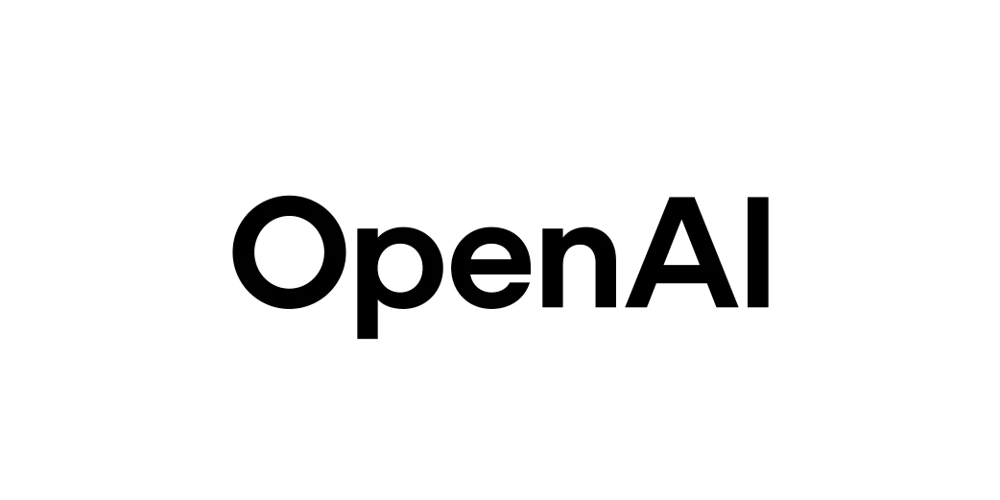

<p>
  
</p>

# Orchestrator

**One agent. Many models. Any provider.**

<p>
  <a href="https://openai.com/codex/"></a>
  &nbsp;&nbsp;
  <a href="https://claude.com/product/claude-code"></a>
  &nbsp;&nbsp;
  <a href="https://github.com/features/copilot/cli"><picture><source media="(prefers-color-scheme: dark)" srcset="./assets/providers/github-copilot-lockup-white.svg"></picture></a>
  &nbsp;&nbsp;
  <a href="https://grok.com/"></a>
  &nbsp;&nbsp;
  <a href="https://pi.dev/"></a>
</p>

<sub>Codex &middot; Claude Code &middot; Copilot CLI &middot; Grok Build &middot; Pi</sub>

Orchestrator is a dead-simple skill built on a powerful local CLI. Work with
one agent; it orchestrates many models across providers and brings their
results back into one place.

You speak in models and outcomes, not provider CLI syntax:

> Use Fable for the UI, GPT-5.6 Sol for the implementation, and Grok 4.5 for
> the small fixes. Run independent work in parallel, then have Opus review the
> result.

> Explore the repository with Kimi 2.7. Give the plan to GPT-5.6 Sol, then use
> Fable only where the interface needs real design work.

Orchestrator discovers current model names and IDs from installed runtimes
instead of relying on stale model slugs.

## Install

```sh
npx skills add backnotprop/orchestrator
npm install -g @backnotprop/orchestrator-cli
```

The CLI install is optional up front. The skill can install it on first use.

## Preferences

Preferences are optional. Edit
[`skills/orchestrator/PREFERENCES.md`](skills/orchestrator/PREFERENCES.md), or
tell your agent what to put there:

```text
Use Fable for extensive UI work.
Use GPT-5.6 Sol for deep execution.
Use Grok 4.5 for small coding tasks.
Use Kimi 2.7 for exploration.
When Fable is unavailable, use GPT-5.6 Sol.
When GPT-5.6 Sol is unavailable, use Opus.
When every preferred model is unavailable, pause and notify me.
```

Human model names are fine. The skill resolves them against live runtime
catalogs, checks available provider limits when supported, and follows the
current request before saved preferences.

## Under The Hood

Every worker is a named task with status, logs, output, follow-up, resume, and
stop controls. Agents use a small JSON command loop:

```sh
orchestrator doctor --json --compact
orchestrator models <runtime> --json --compact
orchestrator launch <runtime> --json --compact --brief "<task>"
orchestrator ps --json --compact --active --brief
orchestrator read <task-id>... --wait --json --compact
orchestrator interrupt <task-id> --json --compact --reason "<reason>"
```

The CLI owns process supervision and task state. The calling agent owns
judgment, delegation, and synthesis.

Read the [Operator Guide](doc/operator-guide.md) for the full control contract,
or see [custom agents](doc/custom-agents.md), [architecture decisions](adr/README.md),
and [provider artwork](assets/providers/README.md).
