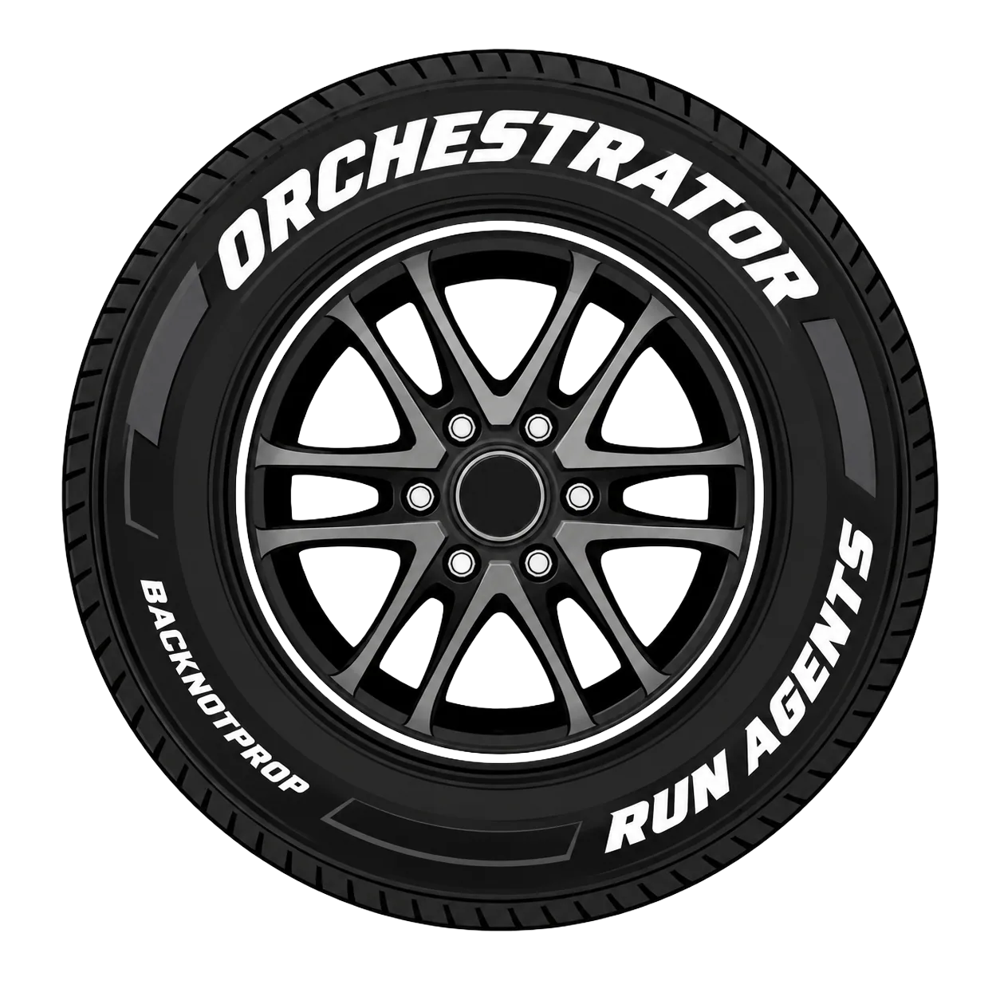

<p>
  
</p>

# Orchestrator

**Agents orchestrating agents.**

Orchestrator is a portable skill backed by a local CLI. Install the skill in
the agent you already use. That agent can then launch, observe, iterate with,
and stop other agents without pretending their work happened in its own
context.

Claude can orchestrate Codex. Codex can orchestrate Claude and Grok. Pi can
launch Copilot. Any agent that can read a skill and run a command can use the
same control plane.

## Install

Install the skill:

```sh
npx skills add backnotprop/orchestrator
```

Install the CLI now, or let the skill install it when first used:

```sh
npm install -g @backnotprop/orchestrator-cli
```

<details>
<summary>Codex and Claude plugin installs</summary>

```sh
# Codex
codex plugin marketplace add backnotprop/orchestrator
codex plugin add orchestrator@orchestrator
```

```text
# Claude Code
/plugin marketplace add backnotprop/orchestrator
/plugin install orchestrator@orchestrator
```

</details>

## Use It

Talk to your current agent:

> Use Orchestrator. Launch Codex to inspect the data layer and Claude Code to
> review the API. Run them in parallel, wait for both, then synthesize the
> result.

Or be specific:

> Launch Grok with model `grok-code-fast-1` to fix the small test failure.

> Launch Claude Code with Opus for the UI implementation. Have Codex review the
> result afterward.

> Explore this repo with Pi, then give the implementation to Codex.

Your agent uses the skill. The skill uses the CLI. The CLI keeps each worker as
a named task with real status, logs, events, output, and stop controls.

## Crawl, Walk, Run

### Crawl: One Delegation

> Use Orchestrator to launch Codex to inspect the task store. Wait for the
> answer.

### Walk: Parallel Specialists

> Launch Claude Code for architecture review, Grok for a focused bug hunt, and
> Pi for exploration. Keep the jobs separate and collect every result.

### Run: Policy-Driven Orchestration

Add preferences once. Then ask:

> Use Orchestrator to handle this with my normal agent and model preferences.
> Fan out independent work, stop duplicates, and wait for the useful results.

Orchestrator can start one task or many, operate across workspaces, and keep
long-running work out of the caller's context until its result is needed.

## Preferences

Preferences are optional. Orchestrator works without them.

The skill ships with
[`PREFERENCES.md`](skills/orchestrator/PREFERENCES.md) beside
`SKILL.md`. Edit it directly, or tell your agent:

> Open the Orchestrator skill preferences and set these rules:
>
> Use Fable only for extensive UI work. Use GPT-5.6 Sol for most deep execution
> work. Use Grok 4.5 Agent for simple coding tasks. Use Pi with Kimi 2.7 for
> exploration. When Fable is out of usage, use GPT-5.6. When GPT-5.6 is out,
> use Opus. When every allowed provider is out of usage, pause new work until
> limits reset and notify me.

Runtime and model names are passed through to installed CLIs. Use names those
CLIs accept.

Preferences are plain language. They can define:

- runtime and model choices by type of work;
- fallback order;
- when to use one agent or fan out;
- what to do when usage is exhausted.

The current request wins over saved preferences. The skill checks live runtime
availability and uses provider limit snapshots when available. Unknown limit
data stays unknown; it is not treated as exhausted.

## What Agents Can Do

- Launch Claude Code, Codex, Copilot CLI, Grok Build, Pi, shell commands, or
  custom runtimes.
- Select a model for each worker.
- Start independent jobs in parallel.
- Watch normalized progress or raw logs.
- Wait for one result or collect many.
- Resume supported provider sessions.
- Send follow-up work to persistent Codex sessions.
- Stop one task, a selected group, a workspace, or deliberate machine-wide
  work.
- Check configured runtimes and supported provider limits before routing.

## Under The Hood

Agents use a small command loop:

```sh
orchestrator doctor --json --compact
orchestrator launch <runtime> --name "<job>" --model <model> --json --compact --brief "<task>"
orchestrator launch -f agents.json --json --compact --brief
orchestrator ps --json --compact --active --brief
orchestrator read <task-id>... --wait --json --compact
orchestrator resume <task-id> --json --compact "<next task>"
orchestrator interrupt <task-id> --json --compact --reason "<reason>"
```

The CLI owns process supervision and task state under
`~/.orchestrator/tasks`. The calling agent owns judgment, delegation, and
synthesis.

Read the [Operator Guide](doc/operator-guide.md) for task storage, supervision,
the JSON control contract, runtime behavior, sessions, configuration, and
diagnostics.

## Extend It

Built-in runtimes cover Claude Code, Codex, Copilot, Grok, Pi, and shell.
Register any other headless process as a
[custom agent](doc/custom-agents.md). Use
[`codex-app-server --session`](doc/codex-app-server.md) when Codex work needs
repeated messages, steering, or native goals.

Run `orchestrator help --json --compact` for the live agent-facing contract.
Architecture decisions live in [`adr/`](adr/README.md).
